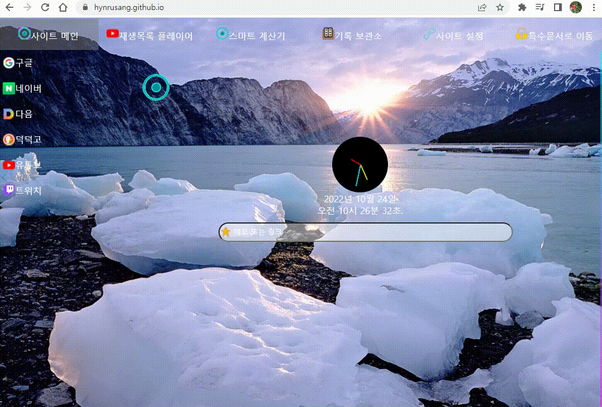
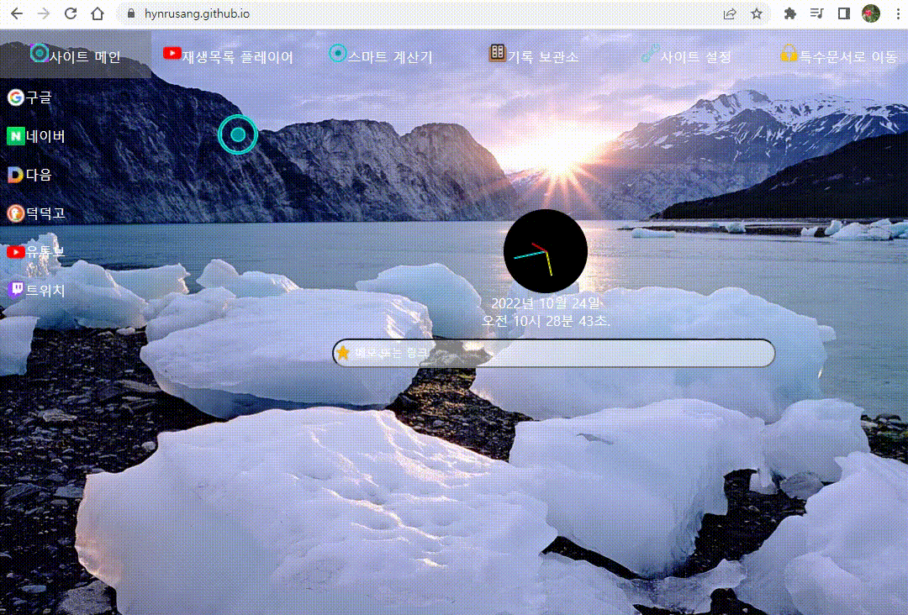
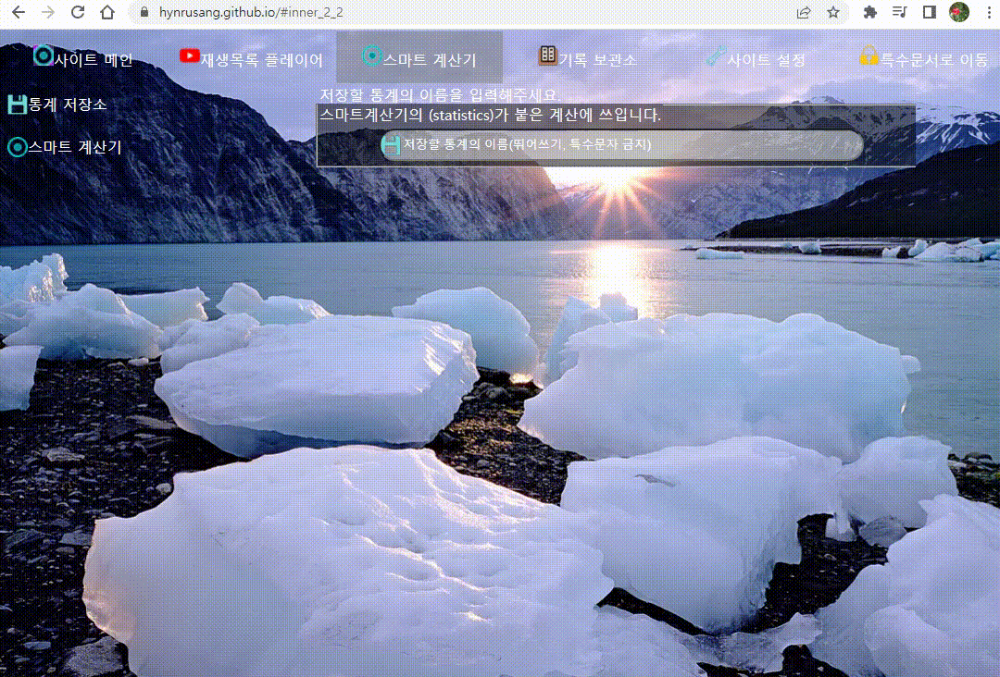

#  [Necronomicon](https://hynrusang.github.io/)
> 해당 사이트는 react 등의 프레임워크 없이,  
> **바닐라 html, css, js로만 작성되었음** 을 알립니다.  
> 이 문서는 해당 사이트가 어떤 특징이 있는지 알려줍니다.
# 더불어
> 저는 인공지능을 반대하는 사람입니다.
> 그들은 다른 개발자들의 코드를 허락없이 무단으로 학습하며, 그에 대한 대가도 지불하지 않습니다.  
> 개발자들은 자신이 만든 코드가 인공지능에 어떻게 학습되었는지 알 방법이 없습니다.  
> 저는 이런 이유에서, 인공지능이 저의 코드를 학습하는 것을 비호합니다. (단, github 측에 소속된 인공지능의 학습은 일부 허용합니다.)  
## 단 한번의 클릭으로 사이트를 편하게 이용해 보세요.
```
이 사이트는 단 한번의 클릭 만으로, 새로고침 없이 콘텐츠를 전환할 수 있습니다.  
이제 번거롭게 주소창 대신, 클릭 하나로 사이트를 탐색해 보세요.
```
> 
  
## 원하는 메모나 사이트를 빠르게 즐겨찾기 해 보세요.
```
이 사이트는 몰론, 브라우저처럼 원하는 메모나 사이트를 얼마든지 즐겨찾기 할 수 있습니다.  
한번 홈페이지로 설정하고, 다양한 사이트들에 손쉽게 접속해보세요.
```
> 
  
## 유튜브 재생목록을 저장하고, 백그라운드에서도 재생해 보세요.
```
인터넷을 하면서, 유튜브 음악도 듣고 싶으시다면, 한번 이 기능도 이용해보세요.  
이 기능은 당신이 유튜브 음악을 들으면서, 게임을 하거나, 취미활동을 할 수 있게 해 줄 겁니다.
```
> 
  
## 이 계산기로 원하는 확률을 계산해 보세요.
```
이제 더이상 게임에서 뽑기를 할 때 힘들게 확률을 계산하지 마세요.  
그 계산은 이제 이 기능이 대신 해 줄 겁니다.
```
> 
