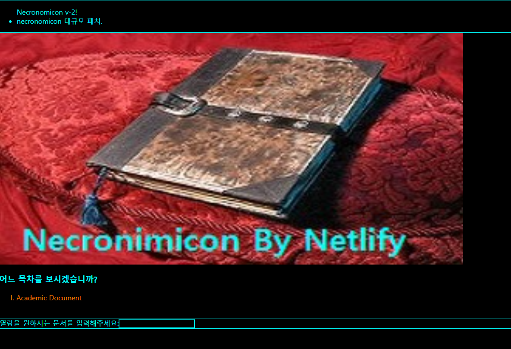

[**Necronomicon**](https://hynrusang.github.io/necronomicon-release/) 설명서
  
======================
# 1. 사이트의 특징
[**Necronomicon**](https://hynrusang.github.io/necronomicon-release/)는 정보 제공 사이트입니다.  
    
사이트가 제공하는 정보들은 아래와 같습니다.  
```
1. 수학
2. C 언어
4. Html
```  
`![3. Python은 v-1에서는 아직 제공되지 않습니다.]` 
  
# 2. 정보
## 2.1. `수학` 
`수학` 메뉴는 말 그대로 수학을 다루는 문서입니다.  
v-1 기준 문서는 다음과 같습니다.  
```
1. 특수 코딩수학 연산법
2. 추정미분 역적분법
```
  
## 2.2 `C 언어`  
`C 언어`는 C 언어의 기본을 다루는 문서입니다.  
v-1 기준 문서는 다음과 같습니다.
```
1. C 언어의 기본
```
## 2.3 `Html`  
`Html`에서는 Html의 각종 태그들에 대한 정보를 담고 있습니다.  
v-1 기준 문서는 다음과 같습니다.  
```
1. Html의 기본
2. 특수문자의 입력
3. 글자 효과의 처리
4. 리스트, 테이블 출력
5. Html 심화학습
6. Style에 관하여(Css)
```